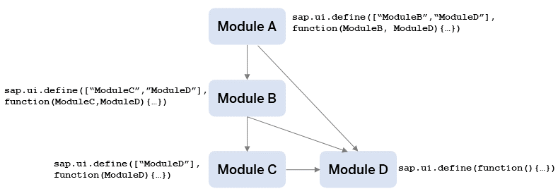

<!-- loio00737d6c1b864dc3ab72ef56611491c4 -->

| loio |
| -----|
| 00737d6c1b864dc3ab72ef56611491c4 |

<div id="loio">

view on: [demo kit nightly build](https://sdk.openui5.org/nightly/#/topic/00737d6c1b864dc3ab72ef56611491c4) | [demo kit latest release](https://sdk.openui5.org/topic/00737d6c1b864dc3ab72ef56611491c4)</div>

## Best Practices for Loading Modules

This section provides best practices for OpenUI5 module loading patterns.

These best practices are especially important when you switch from the synchronous variant of the OpenUI5 module loader to the asynchronous variant. Patterns that may have worked in synchronous module loading may lead to applications that can’t start in asynchronous module loading.

> ### Note:  
> Use the `async` configuration parameter to enable asynchronous module loading via the bootstrap. For more information, see [Standard Variant for Bootstrapping](Standard_Variant_for_Bootstrapping_91f1f45.md).

***

<a name="loio00737d6c1b864dc3ab72ef56611491c4__section_DefineModules"/>

### How to Define Modules

Every OpenUI5 module file must contain exactly one unnamed module definition on the top level: the `sap.ui.define` call. Also, to avoid side-effects, all module-related functions must be defined within the callback function.

**Example**: The following two modules are unnamed. They only contain one top-level `sap.ui.define` and can be addressed with the respective unique module name:

`myLib/MyModuleA.js`

```js
sap.ui.define(function(){
    ...
});
...
```

For troubleshooting information with regard to loading your module, see [Why is my Module Not Loading?](Troubleshooting_for_Loading_Modules_4363b3f.md#loio4363b3fe3561414ca1b030afc8cd30ce__section_moduleloading).

***

<a name="loio00737d6c1b864dc3ab72ef56611491c4__section_AddressModules"/>

### How to Address Modules

A module must always be addressed with the unique module name. The module name is case-sensitive.

`myLib/MyModuleB.js`

```js
sap.ui.define(["myLib/MyModuleA"], function(MyModuleA){
    ...
});
```

For troubleshooting information with regard to addressing modules, see [What is wrong with the way I am addressing the modules?](Troubleshooting_for_Loading_Modules_4363b3f.md#loio4363b3fe3561414ca1b030afc8cd30ce__section_moduleaddressing).

***

#### Migrating Deprecated Pseudo Modules

Historically, types that are defined within a `library.js` could be required as standalone modules. This behavior is deprecated, and the corresponding `library` module should be required instead. The example below showcases three different ways to use types:

-   enum types included in a `library.js`

    e.g. you can use `sap.m.ButtonType` by requiring the `sap/m/library` module since it's documented as "Module: sap/m/library" in the API Reference. The type can then be accessed via the library's module export.

-   enum types provided as a standalone module

    e.g. you should require `sap/ui/model/FilterType` directly since it's documented as "Module: sap/ui/model/FilterType"

-   Instances of DataType included in a `library.js`

    e.g. you can use `sap.ui.core.CSSSize` by first requiring the `sap/ui/core/library` module as documented in the API Reference. The DataType itself can then be accessed via the static [`DataType.getType(...)`](https://sdk.openui5.org/api/sap.ui.base.DataType/methods/sap.ui.base.DataType.getType) API as shown below.

    > ### Note:  
    > Accessing the DataType instance via the library's module export is also deprecated.


```js
sap.ui.require([
    "sap/m/library", // enum sap.m.ButtonType (Module: sap/m/library)
    "sap/ui/model/FilterType" // enum sap.ui.model.FilterType (Module: sap/ui/model/FilterType)
    "sap/ui/base/DataType", // DataType facade (Module: sap/ui/base/DataType)
    "sap/ui/core/library" // includes the DataType "sap.ui.core.CSSSize" (Module: sap/ui/core/library)
], (sapMLib, FilterType, DataType /*, sapUiCoreLib*/) => {
    const { ButtonType } = sapMLib;

    mySapMButton.setType(ButtonType.Emphasized);

    myListBinding.filter(myFilter, FilterType.Application);

    const oCSSSize = DataType.getType("sap.ui.core.CSSSize");
    oCSSSize.isValid("20px") // true
});
```

You can find the corresponding module for each API, enum and control in the API Reference, e.g. [`sap.m.ButtonType`](https://sdk.openui5.org/api/sap.m.ButtonType) and [`sap.ui.model.FilterType`](https://sdk.openui5.org/api/sap.ui.model.FilterType).

***

<a name="loio00737d6c1b864dc3ab72ef56611491c4__section_StructureProject"/>

### How to Structure a Project

The entry point of an OpenUI5 application is often a module that is used to instantiate a OpenUI5 component. This central module is considered as single node of a graph and all dependent modules as well as their dependencies are nodes that must be connected by directed edges: the graph must fulfill the requirements of a directed acyclic graph \(DAG\).

**Example**: All modules are evaluated in a clearly defined order. The evaluation starts with module D, then module C and module B, and ends with module A.



For troubleshooting information with regard to the project structure, see [How can I remove project structures with cyclic dependencies?](Troubleshooting_for_Loading_Modules_4363b3f.md#loio4363b3fe3561414ca1b030afc8cd30ce__section_cyclicdependencies).

-   **[Troubleshooting for Loading Modules](Troubleshooting_for_Loading_Modules_4363b3f.md "The following sections give examples that you must avoid because they cause problems
		when loading your module.")**  
The following sections give examples that you must avoid because they cause problems when loading your module.

