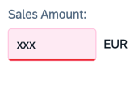

<!-- loiob8c4e534cdb440e9a5bbff86f9572bd6 -->

| loio |
| -----|
| b8c4e534cdb440e9a5bbff86f9572bd6 |

<div id="loio">

view on: [demo kit nightly build](https://sdk.openui5.org/nightly/#/topic/b8c4e534cdb440e9a5bbff86f9572bd6) | [demo kit latest release](https://sdk.openui5.org/topic/b8c4e534cdb440e9a5bbff86f9572bd6)</div>

## Step 11: Validation Using `sap/ui/core/Messaging`

Up to this point, we've created a currency field that formats itself correctly. The *currency* data type can also validate user input to ensure it meets currency requirements. However, OpenUI5 manages data type validation functions and doesn't have a built-in mechanism for reporting error messages back to the UI. We therefore need a way to report error messages from validation functions back to the user. In this step, we're enabling validation for the entire app with a feature known as "Messaging". Once this is set up, any validation error messages based on user input get passed to `Messaging`, which then connects them to the appropriate view and control that caused the error.

***

### Preview

  
  
**An error message is displayed upon entering text into the currency amount input field**


***

### Coding

You can view and download all files in the Demo Kit at [Data Binding - Step 11](https://sdk.openui5.org/entity/sap.ui.core.tutorial.databinding/sample/sap.ui.core.tutorial.databinding.11).

***

### webapp/manifest.json

To generally enable validation in the app, enter the highlighted line into the `manifest.json` file.

```js
...
"sap.ui5": {
	"handleValidation": true,
	"dependencies": {
		"minUI5Version": "1.120.0",
		"libs": {
			"sap.m": {},
			"sap.ui.core": {},
			"sap.ui.layout": {}
		}
	},
...
```

Now, try entering a non-numeric value into the *Sales Amount* field and either press [Enter\] or move the focus to a different UI control. This action triggers either the `onenter` or `onchange` event. OpenUI5 then executes the validation function for the `sap.ui.model.type.Currency` data type.

With validation handling enabled in the manifest, any validation error messages will be picked up by `Messaging`. It checks its list of registered objects and passes the error message back to the correct view for display.

You'll notice that the field in error has a red border: 

However, the error message only displays when that particular field is in focus: 

**Parent topic:**[Data Binding Tutorial](Data_Binding_Tutorial_e531093.md "In this tutorial, we explain the concepts of data binding in OpenUI5.")

**Next:**[Step 10: Property Formatting Using Data Types](Step_10_Property_Formatting_Using_Data_Types_9252ee4.md "OpenUI5 offers a set of simple data types, including Boolean, Currency, Date and Float. You can apply these data types to controls to ensure that the value displayed on the screen is formatted correctly. If the field is open for input, this also ensures that the user input meets the requirements of that data type. Let's add a new field called Sales Amount of type Currency.")

**Previous:**[Step 12: Aggregation Binding Using Templates](Step_12_Aggregation_Binding_Using_Templates_97830de.md "Aggregation binding, also known as &quot;list binding&quot;, lets a control bind to a list within the model data. This binding allows relative binding to the list entries by its child controls.")

**Related Information**  


[Error, Warning, and Info Messages](Error_Warning_and_Info_Messages_62b1481.md "OpenUI5 provides a central place for storing and managing info, warning, and error messages.")

