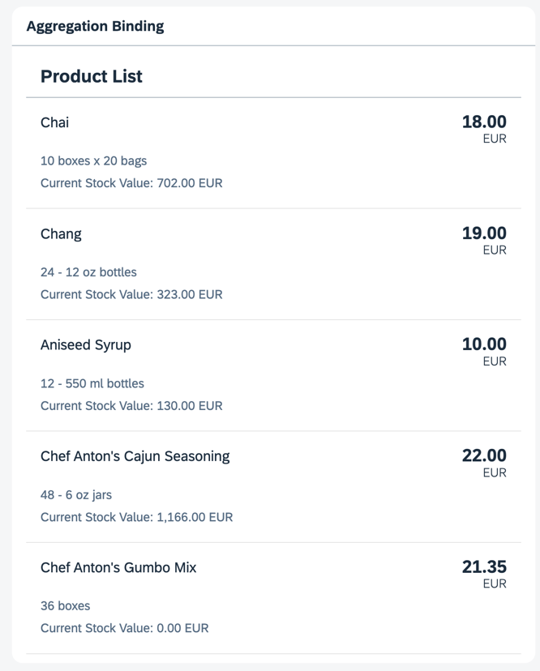

<!-- loio97830de2d7314e93b5c1ee3878a17be9 -->

| loio |
| -----|
| 97830de2d7314e93b5c1ee3878a17be9 |

<div id="loio">

view on: [demo kit nightly build](https://sdk.openui5.org/nightly/#/topic/97830de2d7314e93b5c1ee3878a17be9) | [demo kit latest release](https://sdk.openui5.org/topic/97830de2d7314e93b5c1ee3878a17be9)</div>

## Step 12: Aggregation Binding Using Templates

Aggregation binding \(or "list binding"\) allows a control to be bound to a list within the model data and allows relative binding to the list entries by its child controls.

It will automatically create as many child controls as are needed to display the data in the model using one of the following two approaches:

-   Use template control that is cloned as many times as needed to display the data.

-   Use a factory function to generate the correct control per bound list entry based on the data received at runtime.


***

### Preview

  
  
**A third panel with a list of products is displayed**



***

### Coding

You can view and download all files in the Demo Kit at [Data Binding - Step 12](https://sdk.openui5.org/entity/sap.ui.core.tutorial.databinding/sample/sap.ui.core.tutorial.databinding.12).

1.  Add a new entry `products` to the `models` entry under `sap.ui5` in the `manifest.json` file:

    **webapp/manifest.json**

    ```
    ...
    	"sap.ui5": {
    		"handleValidation": true,
    		"dependencies": {
    			"minUI5Version": "1.120.0",
    			"libs": {
    				"sap.m": {},
    				"sap.ui.core": {},
    				"sap.ui.layout": {}
    			}
    		},
    		"models": {
    			"": {
    				"type": "sap.ui.model.json.JSONModel",
    				"uri": "./model/data.json"
    			},
    			"products" : {
    				"type": "sap.ui.model.json.JSONModel",
    				"uri": "./model/Products.json"
    			},
    			"i18n": {
    				"type": "sap.ui.model.resource.ResourceModel",
    				"settings": {
    					"bundleName": "ui5.databinding.i18n.i18n",
    					"supportedLocales": [
    						"",
    						"de"
    					],
    					"fallbackLocale": ""
    				}
    			}
    		},
    ...
    ```

2.  Create a new file named `Products.json` in the `model` folder. Enter the data for the products:

    **webapp/model/Products.json \(New\)**

    ```
    { "Products": [ {
         "ProductID": 1,
         "ProductName": "Chai",
         "SupplierID": 1,
         "CategoryID": 1,
         "QuantityPerUnit": "10 boxes x 20 bags",
         "UnitPrice": "18.0000",
         "UnitsInStock": 39,
         "UnitsOnOrder": 0,
         "ReorderLevel": 10,
         "Discontinued": false
        }, {
         "ProductID": 2,
         "ProductName": "Chang",
         "SupplierID": 1,
         "CategoryID": 1,
         "QuantityPerUnit": "24 - 12 oz bottles",
         "UnitPrice": "19.0000",
         "UnitsInStock": 17,
         "UnitsOnOrder": 40,
         "ReorderLevel": 25,
         "Discontinued": true
        }, {
         "ProductID": 3,
         "ProductName": "Aniseed Syrup",
         "SupplierID": 1,
         "CategoryID": 2,
         "QuantityPerUnit": "12 - 550 ml bottles",
         "UnitPrice": "10.0000",
         "UnitsInStock": 0,
         "UnitsOnOrder": 70,
         "ReorderLevel": 25,
         "Discontinued": false
        }, {
         "ProductID": 4,
         "ProductName": "Chef Anton's Cajun Seasoning",
         "SupplierID": 2,
         "CategoryID": 2,
         "QuantityPerUnit": "48 - 6 oz jars",
         "UnitPrice": "22.0000",
         "UnitsInStock": 53,
         "UnitsOnOrder": 0,
         "ReorderLevel": 0,
         "Discontinued": false
        }, {
         "ProductID": 5,
         "ProductName": "Chef Anton's Gumbo Mix",
         "SupplierID": 2,
         "CategoryID": 2,
         "QuantityPerUnit": "36 boxes",
         "UnitPrice": "21.3500",
         "UnitsInStock": 0,
         "UnitsOnOrder": 0,
         "ReorderLevel": 0,
         "Discontinued": true
        }]
      }
    ```

3.  In the `App.view.xml` file, add a new panel with an `sap.m.List` control containing the`sap.m.ObjectListItem` template control as shown below. Note that the template control is only present once in the XML view. It will be automatically cloned for each entry in the products' JSON model.

    **webapp/view/App.view.xml**

    ```xml
    ...
    	<Panel headerText="{i18n>panel3HeaderText}" class="sapUiResponsiveMargin" width="auto">
    		<List headerText="{i18n>productListTitle}" items="{products>/Products}">
    			<items>
    				<ObjectListItem title="{products>ProductName}"
    					number="{
    						parts: [
    							{path: 'products>UnitPrice'},
    							{path: '/currencyCode'}
    						],
    						type: 'sap.ui.model.type.Currency',
    						formatOptions: { showMeasure: false }
    					}"
    					numberUnit="{/currencyCode}">
    					<attributes>
    						<ObjectAttribute text="{products>QuantityPerUnit}"/>
    						<ObjectAttribute title="{i18n>stockValue}"
    							text="{
    								parts: [
    									{path: 'products>UnitPrice'},
    									{path: 'products>UnitsInStock'},
    									{path: '/currencyCode'}
    								],
    								formatter: '.formatStockValue'
    							}"/>
    					</attributes>
    				</ObjectListItem>
    			</items>
    		</List>
    	</Panel>
    </mvc:View>
    ```

4.  Also, add another formatter to the `App.controller.js` file to calculate the value of the stock of each product.

    **webapp/controller/App.controller.js**

    ```js
    sap.ui.define([
    	"sap/m/library",
    	"sap/ui/core/mvc/Controller",
    	"sap/ui/model/type/Currency"
    ], (mobileLibrary, Controller, Currency) => {
    	"use strict";
    
    	return Controller.extend("ui5.databinding.controller.App", {
    		formatMail(sFirstName, sLastName) {
    			const oBundle = this.getView().getModel("i18n").getResourceBundle();
    
    			return mobileLibrary.URLHelper.normalizeEmail(
    				sFirstName + "." + sLastName + "@example.com",
    				oBundle.getText("mailSubject", [sFirstName]),
    				oBundle.getText("mailBody"));
    		},
    
    		formatStockValue(fUnitPrice, iStockLevel, sCurrCode) {
    			const oCurrency = new Currency();
    
    			return oCurrency.formatValue([fUnitPrice * iStockLevel, sCurrCode], "string");
    		}
    	});
    });
    ```

5.  Finally, add the missing texts to the `i18n.properties` and `i18n_de.properties` files, which will be used in the newly added UI elements.

    **webapp/i18n/i18n.properties**

    ```ini
    ... 
    # Screen titles
    panel1HeaderText=Data Binding Basics
    panel2HeaderText=Address Details
    panel3HeaderText=Aggregation Binding
    
    ...
    
    # Product list
    productListTitle=Product List
    stockValue=Current Stock Value
    ```

    **webapp/i18n/i18n\_de.properties**

    ```ini
    ...
    # Screen titles
    panel1HeaderText=Data Binding Grundlagen
    panel2HeaderText=Adressdetails
    panel3HeaderText=Aggregation Binding
    
    ...
    
    # Product list
    productListTitle=Artikelliste
    stockValue=Lagerbestand Wert
    ```


**Parent topic:**[Data Binding Tutorial](Data_Binding_Tutorial_e531093.md "In this tutorial, we explain the concepts of data binding in OpenUI5.")

**Next:**[Step 11: Validation Using sap/ui/core/Messaging](Step_11_Validation_Using_sap_ui_core_Messaging_b8c4e53.md "So far, we have created a currency field that can format itself correctly. The currency data type also has the ability to validate that user input adheres to the requirements of a currency; however, data type validation functions are managed by OpenUI5, which of itself has no mechanism for reporting error messages back to the UI; therefore, we need a mechanism for reporting error messages raised by validation functions back to the user. In this step, we will enable validation for the entire app with a feature known as the &quot;Messaging&quot;. Once this is done, any validation error messages generated based on the user input will be passed to Messaging, which in turn will connect them to the appropriate view and control that caused the error.")

**Previous:**[Step 13: Element Binding](Step_13_Element_Binding_6c7c5c2.md "Now we want to do something with that newly generated list. In most cases you will use a list to allow the selection of an item and then show the details of that item elsewhere. In order to achieve this, we use a form with relatively bound controls and bind it to the selected entity via element binding.")

**Related Information**  


[List Binding \(Aggregation Binding\)](List_Binding_Aggregation_Binding_91f0577.md "List binding (or aggregation binding) is used to automatically create child controls according to model data.")

