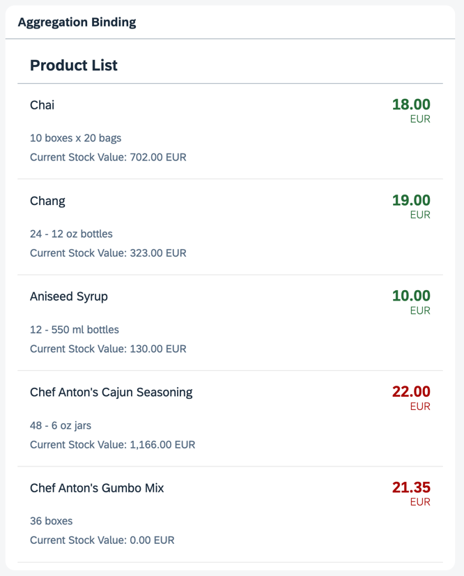

<!-- loio5cff8d1c3fb84c5db7a00f2daca125af -->

| loio |
| -----|
| 5cff8d1c3fb84c5db7a00f2daca125af |

<div id="loio">

view on: [demo kit nightly build](https://sdk.openui5.org/nightly/#/topic/5cff8d1c3fb84c5db7a00f2daca125af) | [demo kit latest release](https://sdk.openui5.org/topic/5cff8d1c3fb84c5db7a00f2daca125af)</div>

## Step 14: Expression Binding

Expression binding lets you display a calculated value on the screen, which is derived from values found in a model object. This feature allows you to insert simple formatting or calculations directly into the data binding string. In this example, we're changing the color of the price depending on whether it's above or below a certain threshold. The threshold value is stored in the JSON model.

***

### Preview

  
  
**Prices are color-coded depending on a selected threshold**



***

### Coding

You can view and download all files in the Demo Kit at [Data Binding - Step 14](https://sdk.openui5.org/entity/sap.ui.core.tutorial.databinding/sample/sap.ui.core.tutorial.databinding.14).

1.  Add a new property called `priceThreshold` with a value of 20 to the `data.json` file.

    **webapp/model/data.json**

    ```
    {
    	"firstName": "Harry",
    	"lastName": "Hawk",
    	"enabled": true,
    	"address": {
    		"street": "Dietmar-Hopp-Allee 16",
    		"city": "Walldorf",
    		"zip": "69190",
    		"country": "Germany"
    	},
    	"salesAmount": 12345.6789,
    	"priceThreshold": 20,
    	"currencyCode": "EUR"
    }
    ```

2.  In the `App.view.xml file`, add a new `numberState` property to the `ObjectListItem` element within the `List`. The value of this property is an expression that gets evaluated for each item. The expression compares each invoice value against the price threshold and returns a number state based on the result.

    **webapp/view/App.view.xml**

    ```xml
    ...
    	<Panel headerText="{i18n>panel3HeaderText}" class="sapUiResponsiveMargin" width="auto">
    		<List headerText="{i18n>productListTitle}" items="{products>/Products}">
    			<items>
    				<ObjectListItem
    					press=".onItemSelected"
    					type="Active"
    					title="{products>ProductName}"
    					number="{
    						parts: [
    							{path: 'products>UnitPrice'},
    							{path: '/currencyCode'}
    						],
    						type: 'sap.ui.model.type.Currency',
    						formatOptions: { showMeasure: false }
    					}"
    					numberUnit="{/currencyCode}"
    					numberState="{= ${products>UnitPrice} > ${/priceThreshold} ? 'Error' : 'Success' }">
    					<attributes>
    						<ObjectAttribute text="{products>QuantityPerUnit}"/>
    						<ObjectAttribute title="{i18n>stockValue}"
    							text="{
    								parts: [
    									{path: 'products>UnitPrice'},
    									{path: 'products>UnitsInStock'},
    									{path: '/currencyCode'}
    								],
    								formatter: '.formatStockValue'
    							}"/>
    					</attributes>
    				</ObjectListItem>
    			</items>
    		</List>
    	</Panel>
    ...
    ```


By binding an expression to the `numberState` property, the error status \(color\) of the price field changes depending on the invoice value.

Consider the following two expressions:

-   `numberState="{= ${products>UnitPrice} > ${/priceThreshold} ? 'Error' : 'Success' }"`

-   `numberState="{= ${products>UnitPrice} <= ${/priceThreshold} ? 'Success' : 'Error' }"`


Can you see why one of these expressions works, and the other doesn't?

Logically, both expressions are identical. However, the first one works, and the second one doesn't: it only produces an empty screen and an "Invalid XML" message in the browser's console. So, what's happening here?

To understand the situation, you need to know how XML files are parsed.

When an XML file is parsed, certain characters have a special \(high priority\) meaning to the XML parser. When these characters are encountered, they're **always** interpreted to be part of the XML definition itself, and not as part of any other content within the XML document.

The XML parser always interprets one of these high-priority characters \(in this case, a less-than \(`<`\) character\) as the start of a new XML tag. This happens regardless of any other meaning that character might have within the context of the expression. This is known as a **syntax collision**.

In our case, the collision occurs between the syntax of XML and the syntax of the JavaScript-like expression language used by OpenUI5.

Therefore, this statement fails because the less-than character is interpreted as the start of an XML tag: `numberState="{= ${products>UnitPrice} <= ${/priceThreshold} ? 'Success' : 'Error' }"`

You can avoid this problem in one of two ways:

-   Reverse the logic of the condition \(use "greater than or equal to" instead of "less than"\)

-   Use the escaped value for the less-than character: `numberState="{= ${products>UnitPrice} &lt;= ${/priceThreshold} ? 'Success' : 'Error' }"` 


Since using an escaped character is not so easy to read, we recommend reversing the logic of the condition and using a greater-than character instead.

The ampersand \(`&`\) character also has a high-priority meaning to the XML parser. This character always means "The start of an escaped character". So, if you'd like to use the Boolean `AND` operator \(`&&`\) in a condition, you must escape both ampersand characters \(`&amp;&amp;`\).

**Parent topic:**[Data Binding Tutorial](Data_Binding_Tutorial_e531093.md "In this tutorial, we explain the concepts of data binding in OpenUI5.")

**Next:**[Step 13: Element Binding](Step_13_Element_Binding_6c7c5c2.md "Now, let's do something with that newly generated list. Typically, you use a list to allow selection of an item and then display the details of that item elsewhere. To accomplish this, we use a form with relatively bound controls and bind it to the selected entity via element binding.")

**Previous:**[Step 15: Aggregation Binding Using a Factory Function](Step_15_Aggregation_Binding_Using_a_Factory_Function_284a036.md "Instead of using a single hard-coded template control, we now opt for a factory function to generate different controls based on the data received at runtime. This approach is much more flexible and allows for the display of complex or heterogeneous data.")

**Related Information**  


[Expression Binding](Expression_Binding_daf6852.md "Expression binding is an enhancement of the OpenUI5 binding syntax, which allows for providing expressions instead of custom formatter functions.")

