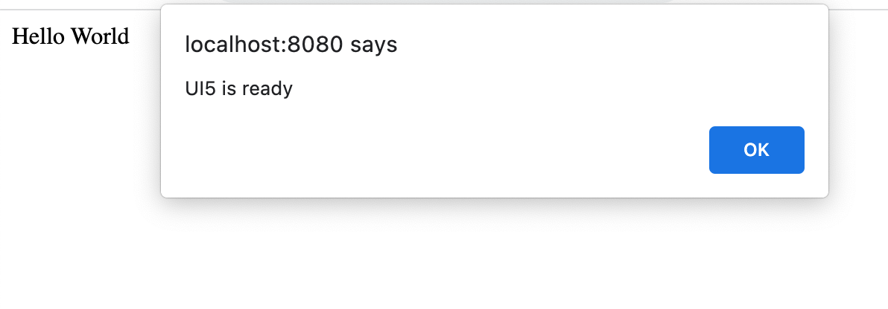

<!-- loiofe12df2e338e43598977d09f3d191b7b -->

| loio |
| -----|
| fe12df2e338e43598977d09f3d191b7b |

<div id="loio">

view on: [demo kit nightly build](https://sdk.openui5.org/nightly/#/topic/fe12df2e338e43598977d09f3d191b7b) | [demo kit latest release](https://sdk.openui5.org/topic/fe12df2e338e43598977d09f3d191b7b)</div>

## Step 2: Bootstrap

Before we can do something with OpenUI5, we need to load and initialize it. This process of loading and initializing OpenUI5 is called **bootstrapping**. Once this bootstrapping is finished, we simply display an alert.

***

### Preview



***

### Coding

You can view and download all files at [Walkthrough - Step 2](https://sdk.openui5.org/entity/sap.m.tutorial.walkthrough/sample/sap.m.tutorial.walkthrough.02).

***

<a name="loiofe12df2e338e43598977d09f3d191b7b__section_mkm_zwb_syb"/>

### UI5 Tooling

First, let's enhance your UI5 Tooling setup:

1.  Open a terminal from the app root folder.

2.  Execute `ui5 use OpenUI5`
3.  Execute `ui5 add sap.ui.core sap.m themelib_sap_horizon`

***

### webapp/index.html

```html
<!DOCTYPE html>
<html>
<head>
	<meta charset="utf-8">
	<title>UI5 Walkthrough</title>
	<script
		id="sap-ui-bootstrap"
		src="resources/sap-ui-core.js"
		data-sap-ui-theme="sap_horizon"
		data-sap-ui-libs="sap.m"
		data-sap-ui-compatVersion="edge"
		data-sap-ui-async="true"
		data-sap-ui-onInit="module:ui5/walkthrough/index"
		data-sap-ui-resourceroots='{
			"ui5.walkthrough": "./"
		}'>

	</script>
</head>
<body>
<div>Hello World</div>
</body>
</html>
```

In this step, we load the OpenUI5 framework from the webserver provided by UI5 Tooling and initialize the core modules with the following configuration options:

-   The `id` attribute of the `<script>` tag has to be exactly `"sap-ui-bootstrap"` to ensure proper booting of the SAPUI5 runtime.
-   The `src` attribute of the `<script>` tag tells the browser where to find the OpenUI5 core library – it initializes the OpenUI5 runtime and loads additional resources, such as the libraries specified in the `data-sap-ui-libs` attribute.

-   The OpenUI5 controls support different themes. We choose `sap_horizon` as our default theme.

-   We specify the required UI library `sap.m`, which contains the UI controls we need for this tutorial.

-   To make use of the most recent functionality of OpenUI5 we define the compatibility version as `edge`.

-   We configure the bootstrapping process to run asynchronously. This means that the OpenUI5 resources can be loaded simultaneously in the background for performance reasons.

-   We define the module to be loaded initially in a declarative way. With this, we avoid directly executable JavaScript code in the HTML file. This makes your app more secure. We'll create the script that this refers to further down in this step.
-   We tell OpenUI5 core that resources in the `ui5.walkthrough` namespace are located in the same folder as `index.html`.


***

<a name="loiofe12df2e338e43598977d09f3d191b7b__section_ks2_1bv_xfb"/>

### webapp/index.js \(New\)

```js
sap.ui.define([], () => {
	"use strict";
	alert("UI5 is ready");
});
```

Now, we create a new `index.js` script that contains the application logic for this tutorial step. We do this to avoid having executable code directly in the HTML file for security reasons. This script will be called from `index.html`. We defined it there as a module in a declarative way.

In the next steps, the structure of a UI5 module will be explained in detail.

**Parent topic:**[Walkthrough Tutorial](Walkthrough_Tutorial_3da5f4b.md "In this tutorial we will introduce you to all major development paradigms of OpenUI5.")

**Next:**[Step 1: Hello World!](Step_1_Hello_World_2680aa9.md "As you know OpenUI5 is all about HTML5. Let’s get started with building a first “Hello World” with only HTML.")

**Previous:**[Step 3: Controls](Step_3_Controls_ddbceec.md "Now it is time to build our first little UI by replacing the “Hello World” text in the HTML body by the OpenUI5 control sap/m/Text. In the beginning, we will use the JavaScript control API to set up the UI, the control instance is then placed into the HTML body.")

**Related Information**  


[Compatibility Version Information](Compatibility_Version_Information_9feb96d.md "Compatibility version flags allow applications to react to incompatible changes in OpenUI5.")

[Bootstrapping: Loading and Initializing](Bootstrapping_Loading_and_Initializing_a04b0d1.md "To use OpenUI5 features in your HTML page, you have to load and initialize the SAPUI5 library.")

[Standard Variant for Bootstrapping](Standard_Variant_for_Bootstrapping_91f1f45.md "The standard variant for bootstrapping loads all JavaScript modules of a library in advance with one single request for performance reasons.")

[Content Security Policy](Content_Security_Policy_fe1a6db.md "Content Security Policy (CSP) adds an additional layer of security that can detect and mitigate certain types of attacks, such as cross-site scripting and data injection.")

