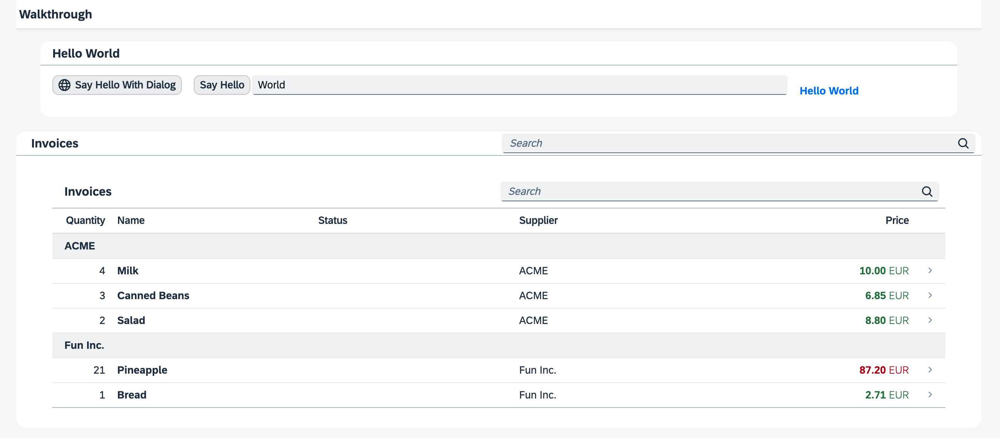

<!-- loioae1be8cc26064274bbc5925a9cd59640 -->

| loio |
| -----|
| ae1be8cc26064274bbc5925a9cd59640 |

<div id="loio">

view on: [demo kit nightly build](https://sdk.openui5.org/nightly/#/topic/ae1be8cc26064274bbc5925a9cd59640) | [demo kit latest release](https://sdk.openui5.org/topic/ae1be8cc26064274bbc5925a9cd59640)</div>

## Step 38: Build Your Application

In this step we're going to build our application and consume the speed of a built OpenUI5 application.

***

### Preview

  
  
**The UI5 application is built and served**



***

<a name="loioae1be8cc26064274bbc5925a9cd59640__section_uxj_4h4_tyb"/>

### Coding

You can view and download all files at [Walkthrough - Step 38](https://sdk.openui5.org/entity/sap.m.tutorial.walkthrough/sample/sap.m.tutorial.walkthrough.38).

***

<a name="loioae1be8cc26064274bbc5925a9cd59640__section_vxj_4h4_tyb"/>

### package.json

We introduce a new npm script called "build", which executes a UI5 Tooling build. We add `-a` as a command-line argument to also build the framework dependencies \(e.g. `sap.ui.core`, etc.\).

```
{
  "name": "ui5.walkthrough",
  "version": "0.0.1",
  "description": "The UI5 walkthrough application",
  "scripts": {
      "start": "ui5 serve -o index.html",
      "build": "ui5 build -a"
  },
  "devDependencies": {
    "@ui5/cli": "^3",
    "ui5-middleware-simpleproxy": "^0.9.10"
  }
}
```

Open a terminal and execute `npm run build` in the project root folder.

Congrats! You have successfully built your UI5 application.

***

<a name="loioae1be8cc26064274bbc5925a9cd59640__section_f2r_rh4_tyb"/>

### Install a Local Web Server

To test the built result, we can serve the build output locally. To do this, we have to add a local web server hosting the built resources. For this tutorial we choose an npm package called [local-web-server](https://www.npmjs.com/package/local-web-server).

Therefore, we have to install the new package by executing `npm i -D local-web-server`.

To actually use the newly added web server, we have to add a new script to our `package.json` which we'll call `serve-dist`. This script starts the `local-web-server` by pointing to the UI5 build output located in the `dist` folder of our project. The `--compress` flag optimizes the responses sent by the server to the client.

***

<a name="loioae1be8cc26064274bbc5925a9cd59640__section_cxw_th4_tyb"/>

### package.json

```
{
  "name": "ui5.walkthrough",
  "version": "0.0.1",
  "description": "The UI5 walkthrough application",
  "scripts": {
      "start": "ui5 serve -o index.html",
      "build": "ui5 build --all --clean-dest",
      "serve-dist": "ws --compress -d dist --open"
  },
  "devDependencies": {
    "@ui5/cli": "^3",
    "ui5-middleware-simpleproxy": "^0.9.10"
  }
}
```

Now it's time to start the server by executing `npm run serve-dist` in a terminal in the project root folder. Your default browser opens automatically and the built application is hosted. The `local-web-server` does not offer proxy capabilities so far, nor does it allow to open a specific HTML file in the browser. To display any data, it is therefore necessary to open the `test/mockServer.html` in the browser instead of the `index.html`.

***

<a name="loioae1be8cc26064274bbc5925a9cd59640__section_u12_lby_tfb"/>

### Congratulations!

You've completed the walkthrough, good job! You should now be familiar with all the major development paradigms and concepts of OpenUI5. Our other tutorials focus on particular aspects of OpenUI5, so feel free to explore!

**Parent topic:**[Walkthrough Tutorial](Walkthrough_Tutorial_3da5f4b.md "In this tutorial we will introduce you to all major development paradigms of OpenUI5.")

**Next:**[Step 37: Accessibility](Step_37_Accessibility_ff7cab1.md "In this step we're going to improve the accessibility of our app.")

