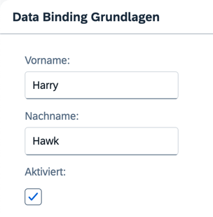

<!-- loio4e593b44e78a431e8b21be6b3915fb55 -->

| loio |
| -----|
| 4e593b44e78a431e8b21be6b3915fb55 |

<div id="loio">

view on: [demo kit nightly build](https://sdk.openui5.org/nightly/#/topic/4e593b44e78a431e8b21be6b3915fb55) | [demo kit latest release](https://sdk.openui5.org/topic/4e593b44e78a431e8b21be6b3915fb55)</div>

## Step 7: \(Optional\) Resource Bundles and Multiple Languages

Resource bundles exist to enable an app to run in multiple languages without the need to change any code. To demonstrate this feature, let's create a German version of the app – in fact, all we need to do is create a German version of the resource bundle file. In our code, we activate the German locale for the ResourceModel.

***

### Preview

  
  
**The texts are now adapted for the German locale**



***

### Coding

You can view and download all files in the Demo Kit at [Data Binding - Step 7](https://sdk.openui5.org/entity/sap.ui.core.tutorial.databinding/sample/sap.ui.core.tutorial.databinding.07).

***

<a name="loio4e593b44e78a431e8b21be6b3915fb55__section_stj_zdp_2mb"/>

### webapp/i18n/i18n\_de.properties \(New\)

In the `i18n` folder, duplicate the `i18n.properties` file and rename its copy to <code>i18n<b>_de</b>.properties</code>. Replace the English text with the German text provided below. The suffix `de` represents the locale for the German language. Since the `de` locale is already set in the `supportedLocales` configuration of the `manifest.json`, it will be taken into account.

```ini
# Field labels
firstName=Vorname
lastName=Nachname
enabled=Aktiviert

# Screen titles
panelHeaderText=Data Binding Grundlagen
```

To check the result, append the `sap-language=DE` URL parameter to the URL in your browser, for example `http://localhost:port/index.html?sap-language=DE`. Once you remove this parameter, your app reverts to your browser's default language.

**Parent topic:**[Data Binding Tutorial](Data_Binding_Tutorial_e531093.md "In this tutorial, we explain the concepts of data binding in OpenUI5.")

**Next:**[Step 6: Resource Models](Step_6_Resource_Models_9790d9a.md "Business applications often require language-specific (translatable) text used as labels and descriptions on the user interface.")

**Previous:**[Step 8: Binding Paths: Accessing Properties in Hierarchically Structured Models](Step_8_Binding_Paths_Accessing_Properties_in_Hierarchically_Structured_Models_9373793.md "In Step 6 , we stated that the fields in a resource model are arranged in a flat structure; in other words, there is no hierarchy of properties. However, this is only true for resource models. The properties within JSON and OData models are usually arranged in a hierarchical structure. So, let's explore how to reference fields in a hierarchically structured model object.")

**Related Information**  


[Localization](Localization_91f217c.md "The framework concepts for text localization in OpenUI5 are aligned with the general concepts of the Java platform.")

