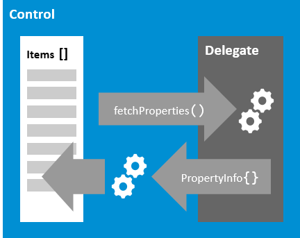
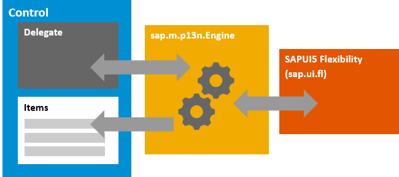

<!-- loio1dd2aa91115d43409452a271d11be95b -->

| loio |
| -----|
| 1dd2aa91115d43409452a271d11be95b |

view on: [demo kit nightly build](https://sdk.openui5.org/nightly/#/topic/1dd2aa91115d43409452a271d11be95b) | [demo kit latest release](https://sdk.openui5.org/topic/1dd2aa91115d43409452a271d11be95b)

## sap.ui.mdc \(experimental\)

The `sap.ui.mdc` library contains composite, metadata-driven controls that assemble UI elements with predefined user experience and various functionalities. The controls can be used as a basis for scalable application development and can be implemented for use with any OpenUI5 model and data protocol.

> ### Note:  
> For SAPUI5 applications for OData V4, SAP Fiori elements provides a flexible programming model based on the `sap.ui.mdc` library. It offers building blocks that can be used without additional integration effort.

> ### Note:  
> The following sections only provide additional information for some of the controls. For a complete list of all controls and their documentation, see the [API Reference](https://sdk.openui5.org/api) and the [Samples](https://sdk.openui5.org/controls). 

***

<a name="loio1dd2aa91115d43409452a271d11be95b__section_y3w_kvf_qxb"/>

### Overview

***

#### Smart Composite Controls

The `sap.ui.mdc` library aims at providing a predefined user experience through metadata-driven UI controls. The generic behavior of those controls is decoupled from the application- or protocol-specific requirements to ensure a flexible usage of those controls independent of the back-end technology. The well-known OpenUI5 development concepts and enterprise-ready qualities are supported out of the box.

***

#### Extensibility of APIs

The controls can be extended by implementable delegates and well-defined APIs for metadata in a unified format. They facilitate XML pre-processing and include as much network-request-dependent information in the XML view cache as possible to speed up the application startup.

***

#### Adaptation via SAPUI5 Flexibility

> ### Note:  
> SAPUI5 flexibility features, such as end user personalization and key user adaptation, only work when using SAPUI5 applications hosted on SAP BTP, SAP S/4HANA, or ABAP platform. For more information, see [Features and Availability](https://help.sap.com/docs/UI5_FLEXIBILITY/430e2c1a4ff241bc8162df4bf51e0730/41ada93054994698ab9067855bb85fe1.html).

The controls offer integrated end user personalization and key user adaptation and support private, shared, and key user variants. A seamless integration with the `sap.ui.fl` library is built into the `sap.ui.mdc` controls, which enables the previously mentioned features while improving application performance at the same time.

***

<a name="loio1dd2aa91115d43409452a271d11be95b__section_hg5_2dm_qxb"/>

### Architecture

***

#### Controls and Delegates

Each `sap.ui.mdc` control consists of a central control part and a delegate that implements the non-generic parts, such as protocol- and model- or application-specific requirements. The implemented delegate encapsulates network requests and the retrieval of cacheable information.

Controls and delegates can be extended from the base classes by the `sap.ui.mdc` adopter leveraging the predefined default behavior. Only in combination with a delegate does a control offer all the advantages outlined initially.

  

***

#### Metadata APIs

As `sap.ui.mdc` controls are supposed to work metadata-driven, service-specific metadata is translated into `propertyInfo` objects. They can include basic information, such as a label for a `Field` control, but also more intricate information, such as the information if a table column supports sorting. The `propertyInfo` objects are provided by the application via the delegate but can also be provided on XML view level to be cached and hence speed up the initial rendering.

  

***

####  SAPUI5 Flexibility Integration

For the integration of SAPUI5 flexibility and its features, the delegates offer specific and easy-to-adopt APIs that enable personalization changes, such as adding items to aggregations or removing them, for example, from table columns, as well as applying filtering or sorting.

The integration of SAPUI5 flexibility is taken over by the `sap.m.p13n.Engine`. It can also be used stand-alone to enable personalization including persistency of any OpenUI5 control.

  

***

#### Built-in Performance Advantages

The application startup time benefits from the metadata APIs and the SAPUI5 flexibility integration. The XML view cache can store the results of the delegate’s metadata processing and the subsequent modification of the XML view by SAPUI5 flexibility change handlers. This behavior should result in a significantly improved performance and fewer requests to the back end, which makes applications cost-efficient.

  

**Related Information**  

[Supported Library Combinations](Supported_Library_Combinations_363cd16.md "OpenUI5 provides a set of JavaScript and CSS libraries, which can be combined in an application using the combinations that are supported.")

[Browser and Platform Support](Browser_and_Platform_Support_74b59ef.md "Here you can find information on the browser and platform support for the OpenUI5 libraries on iOS, Android, macOS, and Windows platforms.")

[API Reference: `sap.ui.mdc`](https://sdk.openui5.org/api/sap.ui.mdc)

